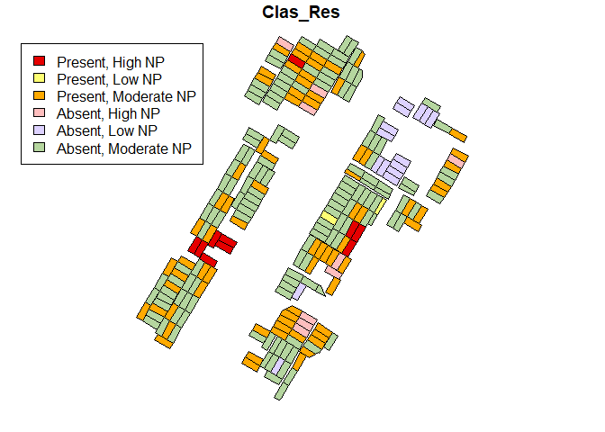

<!-- README.md is generated from README.Rmd. Please edit that file -->

# nearpresence

<!-- badges: start -->
<!-- badges: end -->

The nearpresence package implements Near Presence Cluster Analysis, a
statistical method for identifying spatial clustering within presence /
absence data observed in irregularly distributed areal observation
units. It was developed to aid in the interpretation of data from
archaeological surface survey, specifically, to help identify clusters
of units containing material from a certain chronological period.
However, it will be useful in any context where binary observations are
recorded in areal units that are irregularly distributed and
discontiguous.

## Example

This example comes from the Molyvoti, Thrace, Archaeological Project.  
The following plot shows the distribution of units with Classical-period
material in a portion of the survey area:

``` r
library(nearpresence)
library(sf)
#> Warning: package 'sf' was built under R version 4.0.5
#> Linking to GEOS 3.9.0, GDAL 3.2.1, PROJ 7.2.1
data(tracts)
data(chron)
tr.chr<-merge(tracts, chron, by.x = "UnitID", by.y = "Survey_Uni")
par(xpd=TRUE)
plot(tr.chr["Clas"])
```



Spatial structure is difficult to discern. Near Presence Cluster
Analysis identifies units that have Classical-period material present
and have more neighbors with Classical-material than would be expected
under conditions of complete spatial randomness.

``` r
data(tracts)
data(chron)
np<-NP(chron = chron,
   chron_ID = "Survey_Uni",
   periods = "Clas",
   tracts = tracts,
   tracts_ID = "UnitID",
   swl = IDW_nnear(tracts = tracts, tracts_ID = "UnitID", n = 8),
   perms = 100,
   cut = 0.05)
#> [1] "Calculating distances"
#> [1] "Finding 8 nearest neighbors"
#> [1] "Converting to list"
#> [1] "Clas"
#> [1] "Calculating observed NP"
#> [1] "Calculating permuted NPs"
#> ================================================================================[1] "Compiling results"
par(xpd=TRUE)
plot(np["Clas_Res"], col=NP_colors(np[["Clas_Res"]]))
legend("topleft", 
       legend = c("Present, High NP", "Present, Low NP", "Present, Moderate NP", "Absent, High NP", "Absent, Low NP", "Absent, Moderate NP"), 
       fill = c("#e60000", "#feff73", "#ffaa01","#febebe", "#ddd2ff", "#b5d69f"),
       inset = c(-0.1, -0.1))
```


## Overview

The nearpresence package contains four functions, which are meant to be
used consecutively:  
1. `IDW_nnear` and `IDW_radius` create a spatial weights model in the
form of a list from a `sf` object representing the spatial distribution
of observation units.  
2. `NP` uses the output of either `IDW_nnear` or `IDW_radius` and a
table with chronological data to perform NPCA. It returns a `sf` object
with various results of NPCA stored as attributes. 3. NP\_colors is
useful for displaying the output of `NP` by applying a pre-determined
color scheme.

## Installation

You can install the development version of nearpresence from github
with:

``` r
install.packages("devtools")
devtools::install_github("eweaverdyck/nearpresence")
```
